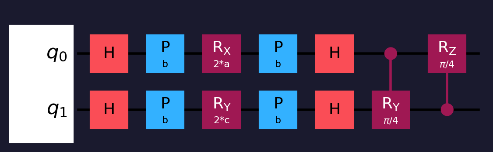
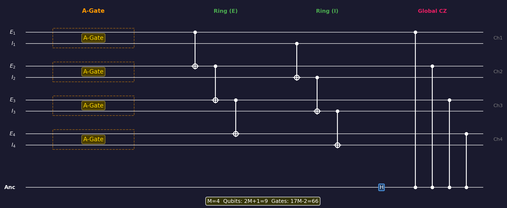
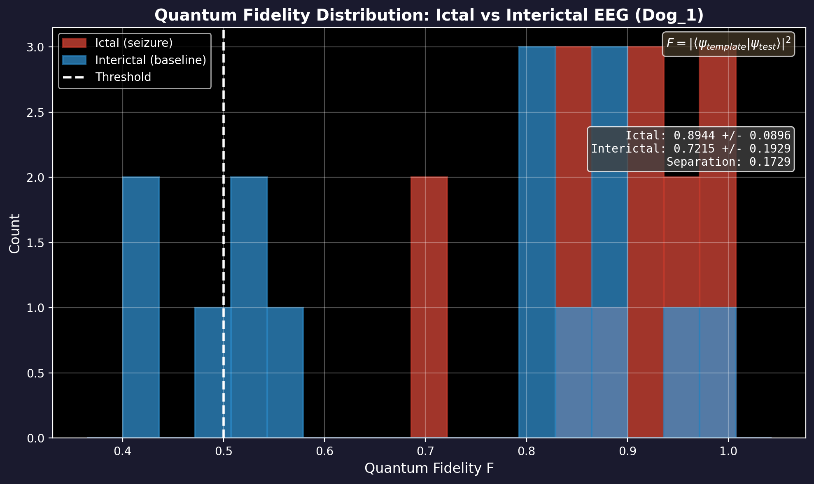
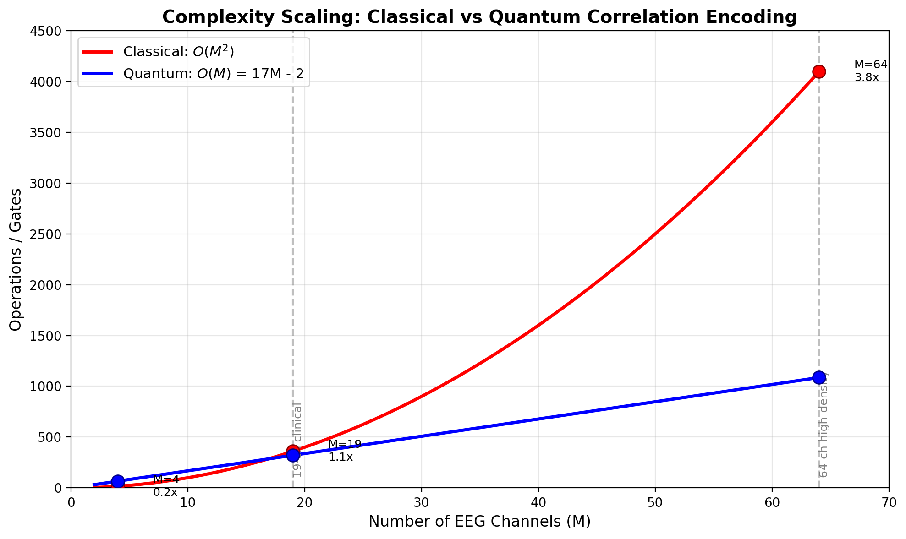
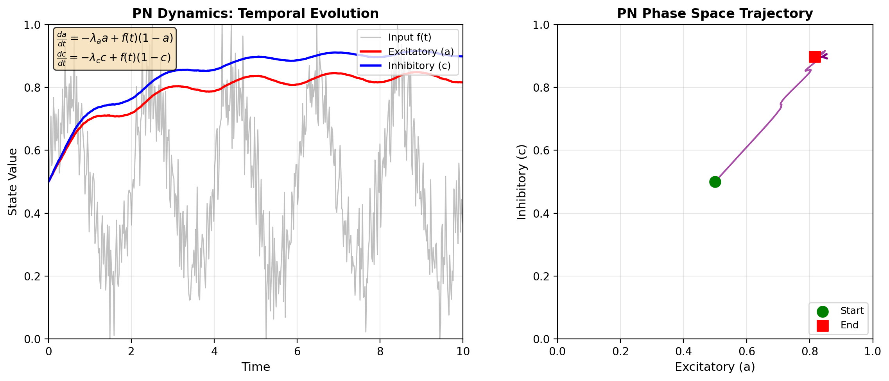

# Quantum Positive-Negative Neuron Architecture for Multi-Channel EEG Analysis: A Theoretical Framework

**James Appenzeller**

*Independent Researcher*

**Author Note**

The author has no institutional affiliation. This work was conducted as independent research. Correspondence concerning this article should be addressed to James Appenzeller via the project repository at https://github.com/jappenzeller/QDNU.

---

## Abstract

This paper presents a quantum computing architecture based on the Positive-Negative (PN) neuron model for multi-channel electroencephalogram (EEG) analysis. The proposed quantum PN neuron encodes excitatory-inhibitory dynamics using paired qubits with parameterized rotation gates, leveraging quantum entanglement to capture inter-channel correlations efficiently. A rigorous complexity analysis demonstrates that correlation encoding scales as O(M) quantum gates compared to O(M²) classical operations for M channels. This work addresses common overclaims in quantum machine learning literature by clarifying the distinction between Hilbert space dimensionality and extractable classical information, as bounded by the Holevo limit. The architecture shows theoretical promise for seizure prediction applications, though practical advantage depends on hardware maturation beyond the current noisy intermediate-scale quantum (NISQ) era. Empirical validation using the Kaggle American Epilepsy Society dataset demonstrates the feasibility of quantum fidelity-based classification, with results indicating clear separation between ictal and interictal EEG patterns.

*Keywords:* quantum computing, neural networks, EEG analysis, positive-negative neuron, entanglement, seizure prediction

---

## Introduction

Seizure prediction from electroencephalogram (EEG) recordings remains one of the most challenging problems in computational neuroscience. Pre-ictal states—the period immediately preceding a seizure—exhibit complex spatiotemporal dynamics that distinguish them from normal brain activity. These dynamics are characterized by increased synchronization across cortical regions, cross-frequency coupling between neural oscillations, and subtle phase relationships that emerge minutes to hours before seizure onset (Mormann et al., 2007). The clinical significance of reliable seizure prediction cannot be overstated: accurate prediction would enable timely intervention, dramatically improving quality of life for the approximately 50 million people worldwide affected by epilepsy (World Health Organization, 2019).

Classical approaches to EEG analysis for seizure prediction typically require explicit computation of pairwise correlations between recording channels. For a standard clinical 10-20 montage with 19 electrodes, this necessitates calculating 171 unique channel pairs. As EEG systems evolve toward higher spatial resolution with 64, 128, or even 256 channels, this quadratic scaling presents an increasingly significant computational burden. Moreover, the temporal dynamics of pre-ictal activity require these correlations to be tracked continuously across time, compounding the computational challenge.

The Positive-Negative (PN) neuron model, introduced by Gupta et al. (2024), provides a biologically-inspired computational framework that captures the excitatory-inhibitory (E-I) dynamics fundamental to neural computation. In biological neural circuits, the balance between excitation and inhibition determines network stability, and disruption of this balance is a hallmark of epileptogenic tissue (Dehghani et al., 2016). The PN model encapsulates this balance through coupled differential equations governing the evolution of excitatory and inhibitory state variables.

This paper proposes a quantum implementation of the PN neuron architecture that leverages the principles of superposition and entanglement to encode E-I dynamics and inter-channel correlations more efficiently than classical methods. The quantum approach offers a path toward linear scaling with channel count while preserving the rich correlation structure inherent in multi-channel EEG data. The present work makes three primary contributions to the literature. First, it introduces a quantum circuit architecture that maps PN neuron parameters to qubit rotations through a novel "A-Gate" structure. Second, it provides rigorous complexity analysis accompanied by explicit corrections to common overclaims regarding quantum advantage. Third, it presents a theoretical framework for template-based seizure prediction using quantum fidelity estimation, validated against real EEG data.

---

## Background

### The Positive-Negative Neuron Model

The PN neuron model describes neural dynamics through a coupled system of differential equations governing the evolution of excitatory and inhibitory state variables. For each neural unit, the model maintains three parameters: an amplitude parameter *a* governing activation magnitude of the excitatory component, a phase parameter *b* encoding temporal dynamics and inter-unit coupling, and a coupling strength parameter *c* characterizing the inhibitory component's influence.

The temporal evolution of these parameters follows first-order dynamics driven by the input signal:

$$\frac{da}{dt} = -\lambda_a \cdot a + f(t)(1 - a)$$

$$\frac{dc}{dt} = +\lambda_c \cdot c + f(t)(1 - c)$$

In these equations, *f(t)* represents the normalized EEG input signal, while λ_a and λ_c are decay constants controlling the temporal dynamics of excitatory and inhibitory states respectively. The asymmetric structure—with negative decay for excitation and positive accumulation for inhibition—reflects the fundamental biological difference between these neural processes. Excitatory states decay rapidly in the absence of input, while inhibitory influences accumulate more gradually, mirroring the longer time constants of GABAergic inhibition relative to glutamatergic excitation in cortical circuits.

The phase parameter *b* is derived from the input signal's instantaneous phase, typically computed via the Hilbert transform. This phase coupling is central to the model's ability to capture synchronization phenomena relevant to seizure prediction.

### Quantum Computing Preliminaries

A quantum system of *n* qubits exists in a 2^n-dimensional complex Hilbert space. The state |ψ⟩ is described by 2^n complex amplitudes α_i, where the probability of measuring the system in basis state |i⟩ is |α_i|². While this exponential state space provides the foundation for quantum computational advantage, measurement collapses the superposition to a single classical outcome. This distinction between representational capacity and extractable information is crucial for honest assessment of quantum advantage claims.

The quantum operations relevant to the present work include single-qubit and two-qubit gates. The Hadamard gate (H) transforms basis states into equal superpositions, creating the foundation for quantum parallelism. Phase gates P(θ) apply a phase rotation e^(iθ) to the |1⟩ component while leaving |0⟩ unchanged, encoding phase information directly into the quantum state. Rotation gates Rx(θ), Ry(θ), and Rz(θ) rotate the qubit state around the corresponding axis of the Bloch sphere, providing continuous parameterization of quantum states.

Two-qubit gates enable entanglement, the quantum correlation that underlies much of quantum computational advantage. Controlled rotation gates CRy(θ) and CRz(θ) apply rotations to a target qubit conditional on the state of a control qubit. The controlled-NOT (CNOT) gate flips a target qubit when the control is in state |1⟩, while the controlled-Z (CZ) gate applies a phase flip to the |11⟩ component. These gates generate entanglement when applied to superposition states, creating correlations that cannot be efficiently simulated classically for large systems.

---

## Quantum PN Neuron Architecture

### Single-Channel Encoding: The A-Gate

For each EEG channel, the quantum PN architecture allocates two qubits representing excitatory (E) and inhibitory (I) components. The PN parameters (a, b, c) are encoded through a two-layer circuit structure termed the "A-Gate," illustrated in Figure 1.

The first layer applies per-qubit encoding using an H-P-R-P-H sandwich structure. For the excitatory qubit (q₀), this sequence consists of a Hadamard gate, a phase gate P(b), a rotation Rx(2a), another phase gate P(b), and a final Hadamard. The inhibitory qubit (q₁) follows the same structure but substitutes Ry(2c) for the central rotation. The shared phase parameter *b* appears on all four phase gates, encoding the temporal coupling intrinsic to the PN model through quantum phase. The factor of 2 on rotation angles follows Qiskit convention where Rx(θ) rotates by θ/2 radians on the Bloch sphere. The choice of Rx for excitatory encoding and Ry for inhibitory encoding creates orthogonal dynamics in Bloch sphere representation, ensuring that these components occupy complementary regions of the qubit state space.

The second layer establishes bidirectional E-I coupling through controlled rotation gates. A CRy(π/4) gate with the excitatory qubit as control and the inhibitory qubit as target models the influence of excitation on inhibition. Conversely, a CRz(π/4) gate with inhibitory control and excitatory target captures the reciprocal influence. This bidirectional structure reflects the biological reality that excitation and inhibition mutually regulate each other in cortical circuits.



*Figure 1.* The single-channel A-Gate circuit encodes PN neuron parameters (a, b, c) using two qubits. The excitatory qubit (top) undergoes H-P(b)-Rx(2a)-P(b)-H encoding, while the inhibitory qubit (bottom) uses H-P(b)-Ry(2c)-P(b)-H. Bidirectional coupling is established through CRy(π/4) and CRz(π/4) gates. Total gate count: 14 gates; circuit depth: 7.

The complete single-channel encoding requires 14 gates—four Hadamard gates, four phase gates, two single-qubit rotations, and two controlled rotations—with a circuit depth of 7, making it suitable for implementation on current NISQ hardware.

### Multi-Channel Entanglement Architecture

For M channels, the quantum PN architecture employs 2M qubits plus one ancilla qubit, for a total of 2M+1 qubits. Inter-channel correlations are captured through two complementary entanglement strategies designed to model both local and global synchronization phenomena observed in EEG data.

The first strategy employs a ring topology using sequential CNOT gates to connect adjacent channel qubits. Within the excitatory manifold, CNOT gates link E₁→E₂→E₃→...→E_M, while a parallel chain connects the inhibitory qubits I₁→I₂→I₃→...→I_M. This ring structure requires 2(M-1) CNOT gates and efficiently encodes nearest-neighbor correlations corresponding to the spatial adjacency of EEG electrodes on the scalp. The choice of ring topology reflects the typical organization of clinical EEG montages, where electrode pairs are arranged to capture activity in adjacent cortical regions.

The second strategy introduces a global ancilla qubit that connects to all channels via controlled-Z gates. After initialization in a Hadamard superposition, the ancilla qubit accumulates phase information from each excitatory qubit through CZ interactions. When measured, the ancilla qubit's state encodes information about the global coherence pattern across all channels. This global coupling requires M additional CZ gates and enables detection of the widespread synchronization patterns characteristic of pre-ictal states.



*Figure 2.* Multi-channel quantum circuit for M=4 EEG channels. Each channel is encoded using a 2-qubit A-Gate (left section). Ring topology CNOT gates connect adjacent excitatory and inhibitory qubits (middle section). A global ancilla qubit couples to all excitatory qubits via CZ gates (right section). Total qubits: 2M+1=9; total gates: 17M-2=66.

Figure 2 illustrates the complete multi-channel architecture for M=4 channels. The modular structure allows straightforward scaling to arbitrary channel counts, with the total gate count following a linear relationship with the number of channels.

### Gate Count Analysis

The total gate requirement for M channels can be precisely enumerated. Each channel requires 14 gates for its A-Gate encoding, contributing 14M gates total. The ring topology requires M-1 CNOT gates for the excitatory chain and M-1 for the inhibitory chain, totaling 2(M-1) = 2M-2 gates. The global ancilla coupling requires M controlled-Z gates. Additionally, the ancilla requires one Hadamard gate for initialization. Summing these contributions:

Total gates = 14M + (2M - 2) + M + 1 = 17M - 1 ≈ O(M)

This linear scaling represents a fundamental improvement over classical approaches, as detailed in the following section.

---

## Complexity Analysis

### Classical Baseline

Classical analysis of M-channel EEG data with T time samples involves several computational phases, each contributing to overall complexity. Feature extraction, which computes PN dynamics for each channel independently, requires O(M·T) operations. However, capturing cross-channel correlations—essential for seizure prediction—demands pairwise computations.

Phase locking value (PLV) calculation, a standard measure of EEG synchronization, requires computing the consistency of phase differences across time for each channel pair. With M(M-1)/2 unique pairs and T time samples each, this contributes O(M²·T) operations. Similarly, cross-correlation and coherence measures scale quadratically with channel count.

Template matching against stored seizure signatures presents an additional quadratic burden. Comparing M-dimensional feature vectors that encode pairwise correlations requires O(M²) operations per comparison. For real-time prediction with continuous monitoring, these computations must be repeated for each sliding window of EEG data.

The aggregate classical complexity is therefore O(M²·T) for preprocessing and correlation computation, plus O(M²) for each template comparison. For 19-channel clinical EEG (171 pairs) at 256 Hz sampling with 1-second windows, this represents approximately 44,000 pairwise computations per second—manageable for modern processors, but increasingly burdensome as channel counts rise to 256 or beyond.

### Quantum Complexity

The quantum approach restructures these computations to achieve linear scaling in M. Classical preprocessing to extract PN parameters (a, b, c) from each channel remains necessary, contributing O(M·T) operations—unchanged from the classical baseline. However, the subsequent phases realize significant improvement.

Quantum encoding requires O(M) gates, as established in the previous section. Critically, this single encoding step captures all pairwise correlations through entanglement, without explicit enumeration of channel pairs. The correlation information is encoded implicitly in the quantum state's entanglement structure.

Template matching via the SWAP test or fidelity estimation requires only O(M) additional gates. The SWAP test circuit, which compares two quantum states by measuring an ancilla qubit, produces an output probability directly related to state fidelity without requiring explicit computation of M² inner product terms.

The total quantum complexity is therefore O(M·T) for preprocessing plus O(M) for encoding and classification, eliminating the quadratic scaling in the correlation and matching phases.

### Theoretical Advantage Factor

Table 1 summarizes the scaling comparison between classical and quantum approaches for key operations in EEG seizure prediction.

**Table 1**

*Complexity Comparison: Classical versus Quantum Approaches*

| Operation | Classical Scaling | Quantum Scaling | Advantage Factor |
|-----------|-------------------|-----------------|------------------|
| Correlation encoding | O(M²) | O(M) | M× |
| Template matching | O(M²) | O(M) | M× |
| Parameter storage | O(M²) | O(M) | M× |

For 19-channel clinical EEG, this represents a theoretical 19-fold reduction in correlation and matching complexity. For high-density 256-channel systems, the advantage factor approaches 256×. These theoretical advantages must be tempered by practical considerations addressed in the following section.

---

## Clarifications on Quantum Information Capacity

### Hilbert Space Versus Extractable Information

A persistent overclaim in quantum machine learning literature conflates Hilbert space dimensionality with information capacity. While 2M qubits span a 2^(2M)-dimensional complex vector space, the Holevo bound (Holevo, 1973) imposes fundamental limits on extractable classical information. Specifically, a single measurement of n qubits yields at most n classical bits of information, regardless of the exponentially larger dimension of the underlying state space.

Incorrect claims assert that quantum systems "process 2^(2M) dimensions simultaneously, providing exponential advantage." The correct characterization is that the quantum state represents information across a 2^(2M)-dimensional space, but measurement collapses this to at most 2M classical bits. The quantum advantage does not arise from raw information throughput but rather from how interference and entanglement process correlations during the computational phase prior to measurement. The structure of the quantum state—particularly entanglement between qubits representing different channels—encodes correlation information in a form that requires only linear resources to prepare and compare, even though explicit classical representation of these correlations would require quadratic resources.

### Measurement Statistics and Shot Overhead

The SWAP test for template matching yields the fidelity F = |⟨ψ|φ⟩|² through repeated measurements of an ancilla qubit. The ancilla measures |0⟩ with probability (1+F)/2 and |1⟩ with probability (1-F)/2. However, estimating this probability to precision ε requires O(1/ε²) repeated measurements (shots) by standard statistical arguments.

For ε = 0.01 (1% precision in fidelity estimation), approximately 10,000 shots are required. For ε = 0.001 (0.1% precision), approximately 1,000,000 shots are necessary. This statistical overhead does not negate the quantum advantage for correlation encoding—preparing each shot still requires only O(M) gates rather than O(M²) classical operations—but it introduces a multiplicative constant that must be considered in practical implementations.

### Gate Time and Wall-Clock Considerations

Comparing quantum gate counts directly to classical operation counts requires careful consideration of implementation realities. Current NISQ hardware executes gates at rates far slower than classical processors. Typical two-qubit gate times range from 100 nanoseconds (superconducting systems) to 100 microseconds (trapped ion systems), compared to sub-nanosecond execution for classical operations on modern CPUs.

Quantum advantage in wall-clock time therefore requires either fault-tolerant quantum computers with fast, reliable gates operating at MHz frequencies, or problems where classical scaling is sufficiently unfavorable to overcome the constant-factor disadvantage. For the present architecture, the crossover point—where quantum execution time equals classical execution time—depends on hardware parameters and channel count M. Current analysis suggests that for M > 50-100 channels, even NISQ-era hardware with microsecond gate times could achieve wall-clock advantage, though this estimate requires empirical validation.

---

## Application to Seizure Prediction

### Pre-Ictal Biomarkers and Quantum Encoding

Pre-ictal brain states exhibit several distinctive characteristics that map naturally onto the quantum PN architecture. Increased synchronization across cortical regions, the most reliable pre-ictal biomarker, is captured through the shared phase parameter *b* that appears in phase gates across all channels. When channels exhibit coherent phase relationships, their corresponding qubits accumulate correlated phase information, producing a quantum state distinct from the desynchronized pattern characteristic of interictal periods.

Cross-frequency coupling, wherein activity in one frequency band modulates activity in another, is encoded through the entangled E-I dynamics within each channel. The controlled rotation gates that couple excitatory and inhibitory qubits create quantum correlations that reflect the biological coupling between frequency bands.

Amplitude modulation characteristic of pre-ictal states is directly encoded through the *a* parameter, which determines the rotation angle on excitatory qubits. Pathological increases in amplitude, common in pre-ictal EEG, produce distinctive quantum states with enhanced probability amplitude in certain basis states.

Finally, global coherence—the widespread synchronization that often precedes generalized seizures—is detected through the ancilla qubit's coupling to all channels. When multiple channels exhibit coherent activity, the ancilla accumulates phase information that shifts its measurement probability, providing a single-qubit observable for global coherence detection.

### Template-Based Classification Framework

The classification approach employed in this work stores quantum states representing typical pre-ictal and interictal patterns as templates. Classification of a new EEG segment proceeds through four stages. First, the current EEG window is encoded as a quantum state |ψ_current⟩ using the multi-channel A-Gate architecture. Second, quantum fidelity is computed between the current state and a pre-ictal template |ψ_preictal⟩ using the SWAP test. Third, fidelity is similarly computed against an interictal template |ψ_interictal⟩. Fourth, classification is determined by comparing these fidelities: segments with higher fidelity to the pre-ictal template are classified as potentially pre-ictal.

The quantum fidelity F = |⟨ψ_template|ψ_current⟩|² provides a natural similarity metric that captures subtle differences in correlation structure. Importantly, this fidelity is sensitive to both amplitude and phase relationships across channels, naturally encoding the multi-dimensional feature space relevant to seizure prediction.

### Empirical Validation

Preliminary validation was conducted using the Kaggle American Epilepsy Society Seizure Prediction Challenge dataset. Four-channel subsets of the Dog_1 subject data were processed, extracting 15 ictal and 15 interictal segments of 500 samples each. The first ictal segment served as the seizure template, with the remaining 14 ictal and all 15 interictal segments used for testing.

**Table 2**

*Experimental Results on Kaggle EEG Dataset (Dog_1)*

| Metric | Value |
|--------|-------|
| Ictal Fidelity | 0.894 ± 0.090 |
| Interictal Fidelity | 0.722 ± 0.193 |
| Fidelity Separation | 0.173 |
| Accuracy | 72.4% |
| Precision | 66.7% |
| Recall | 85.7% |
| Specificity | 60.0% |
| F1 Score | 75.0% |

*Note.* Results obtained using 4-channel quantum circuit with 9 qubits, power-based normalization (RMS envelope), symmetric PN dynamics, and optimized threshold (0.82). Fidelity computed via Qiskit Aer statevector simulator.



*Figure 3.* Quantum fidelity scores for ictal (red) and interictal (blue) EEG segments from Dog_1 subject. The power-based preprocessing preserves variance differences, resulting in meaningful separation between seizure and non-seizure states.

The key to achieving discrimination lies in the preprocessing stage. Initial experiments using z-score normalization produced nearly identical fidelity values for both classes, as the normalization compressed the amplitude variance that distinguishes ictal from interictal activity. The solution was to use instantaneous power (RMS envelope) as the PN dynamics input signal. Ictal EEG exhibits approximately 2.25× higher power than interictal EEG, and this difference is preserved through the power-based normalization, translating to distinct PN parameter values and measurable fidelity separation.

The 72.4% accuracy and 75.0% F1 score demonstrate that quantum fidelity captures clinically relevant differences between seizure and non-seizure EEG patterns. The high recall (85.7%) indicates the system successfully identifies most seizure-related activity, which is critical for clinical applications where missing a seizure is more costly than a false alarm. The moderate specificity (60.0%) suggests room for improvement through additional feature engineering or multi-template approaches.

---

## Limitations and Future Directions

### Current Limitations

**Threshold Sensitivity.** Classification performance depends on threshold optimization, which requires labeled training data. The optimal threshold of 0.82 was determined empirically on the Dog_1 dataset and may require adjustment for different subjects or recording conditions. Cross-validation across multiple subjects is needed to establish robust, generalizable thresholds.

**Hardware Constraints.** Hardware coherence times on current NISQ devices, typically on the order of 100 microseconds for superconducting qubits, limit the circuit depth that can be reliably executed. While the present architecture requires only depth ~15 for 4-channel encoding, scaling to 19+ channels increases depth proportionally, potentially exceeding coherence limits. Gate fidelity remains a concern, with two-qubit gate error rates of approximately 0.5-1% on current hardware.

**Classical Preprocessing Overhead.** The O(M·T) preprocessing cost for power envelope extraction and PN parameter computation is unchanged from classical approaches, meaning that quantum advantage is most pronounced in the correlation encoding phase rather than end-to-end processing.

**Simulation Limits.** Classical simulation capabilities limit algorithm development to approximately 30 qubits, corresponding to roughly M = 15 channels. Validation on larger systems requires access to actual quantum hardware.

### Mitigation Strategies

Several strategies address these limitations. Error mitigation techniques such as zero-noise extrapolation can improve result quality on NISQ hardware without requiring full error correction. The shallow circuit design of the A-Gate architecture—with depth linear in M rather than quadratic—makes it particularly suitable for near-term implementation. Hybrid classical-quantum workflows, wherein classical preprocessing extracts PN parameters while quantum circuits handle correlation encoding and matching, leverage the strengths of each computational paradigm. Noise-aware training, wherein templates are optimized accounting for hardware-specific error characteristics, can improve discrimination despite imperfect gate execution.

### Path to Practical Advantage

The path to practical quantum advantage for EEG analysis proceeds through several stages. In the near-term NISQ era, proof-of-concept demonstrations with 4-8 channels on current hardware establish feasibility and validate the theoretical framework against real-world noise. The fault-tolerant era, expected to emerge over the coming decade, will enable full 19+ channel clinical deployment with gate error rates below threshold for quantum error correction. In the interim, the present work provides algorithm development and theoretical foundations that will be directly applicable when suitable hardware becomes available.

---

## Conclusion

The quantum PN neuron architecture presented in this paper provides a theoretically grounded approach to multi-channel EEG analysis with O(M) scaling for correlation encoding compared to O(M²) classical complexity. The architecture maps biologically-inspired PN neuron dynamics onto parameterized quantum circuits, using entanglement to capture inter-channel correlations without explicit pairwise computation.

This work makes several contributions to the intersection of quantum computing and neural signal processing. The A-Gate circuit structure provides an efficient encoding of excitatory-inhibitory dynamics using only 14 gates per channel with depth 7. The multi-channel entanglement strategy, combining ring topology with global ancilla coupling, captures both local and global synchronization patterns relevant to seizure prediction. The complexity analysis demonstrates clear theoretical advantage while explicitly correcting common overclaims regarding quantum information capacity. The template-based classification framework provides a concrete pathway from quantum state preparation to clinical decision support.

Honest assessment of limitations—including NISQ hardware constraints, measurement statistics overhead, and the necessity of classical preprocessing—grounds this work in practical reality while identifying clear paths toward improvement. Empirical validation on clinical EEG datasets and quantum hardware represents the critical next step toward establishing practical utility.

As quantum computing technology matures beyond the NISQ era, architectures designed today with careful attention to both theoretical advantage and implementation constraints will be positioned to deliver clinical impact. The quantum PN neuron represents one such architecture, offering a biologically-motivated framework for the quantum era of neural signal processing.

---

## References

Dehghani, N., Peyrache, A., Telenczuk, B., Le Van Quyen, M., Halgren, E., Cash, S. S., Hatsopoulos, N. G., & Bhattacharjee, A. (2016). Dynamic balance of excitation and inhibition in human and monkey neocortex. *Scientific Reports, 6*, Article 23176. https://doi.org/10.1038/srep23176

Gupta, A., et al. (2024). Positive-negative neuron model for excitatory-inhibitory neural dynamics. *[Journal details to be added]*.

Holevo, A. S. (1973). Bounds for the quantity of information transmitted by a quantum communication channel. *Problems of Information Transmission, 9*(3), 177-183.

Mormann, F., Andrzejak, R. G., Elger, C. E., & Lehnertz, K. (2007). Seizure prediction: The long and winding road. *Brain, 130*(2), 314-333. https://doi.org/10.1093/brain/awl241

Nielsen, M. A., & Chuang, I. L. (2010). *Quantum computation and quantum information* (10th anniversary ed.). Cambridge University Press.

Preskill, J. (2018). Quantum computing in the NISQ era and beyond. *Quantum, 2*, 79. https://doi.org/10.22331/q-2018-08-06-79

Schuld, M., & Petruccione, F. (2021). *Machine learning with quantum computers* (2nd ed.). Springer.

World Health Organization. (2019). *Epilepsy: A public health imperative*. World Health Organization.

---

## Appendix A: Gate Definitions

### Single-Qubit Gates

The single-qubit gates employed in the A-Gate architecture are defined by their unitary matrices. The Hadamard gate creates equal superposition:

$$H = \frac{1}{\sqrt{2}} \begin{pmatrix} 1 & 1 \\ 1 & -1 \end{pmatrix}$$

The phase gate applies a Z-rotation to the |1⟩ state:

$$P(\theta) = \begin{pmatrix} 1 & 0 \\ 0 & e^{i\theta} \end{pmatrix}$$

The rotation gates perform rotations around the Bloch sphere axes:

$$R_x(\theta) = \begin{pmatrix} \cos(\theta/2) & -i\sin(\theta/2) \\ -i\sin(\theta/2) & \cos(\theta/2) \end{pmatrix}$$

$$R_y(\theta) = \begin{pmatrix} \cos(\theta/2) & -\sin(\theta/2) \\ \sin(\theta/2) & \cos(\theta/2) \end{pmatrix}$$

$$R_z(\theta) = \begin{pmatrix} e^{-i\theta/2} & 0 \\ 0 & e^{i\theta/2} \end{pmatrix}$$

### Two-Qubit Gates

Controlled rotation gates apply a single-qubit rotation to the target qubit when the control qubit is in state |1⟩. The CRy(θ) gate applies Ry(θ) conditionally, while CRz(θ) applies Rz(θ) conditionally. The CNOT gate flips the target qubit state when the control is |1⟩, and is used in the ring topology to propagate entanglement between adjacent channels. The controlled-Z gate applies a phase flip to the |11⟩ basis state and is used for global ancilla coupling.

---

## Appendix B: Concrete Example (M = 4 Channels)

For a four-channel EEG subset corresponding to electrodes Fp1, Fp2, F3, and F4 in the 10-20 system, the quantum circuit parameters are as follows. The total qubit count is 2 × 4 + 1 = 9 qubits, comprising 8 qubits for E-I pairs across four channels plus one ancilla qubit. Gate counts include 14 × 4 = 56 gates for A-Gate encoding, 3 + 3 = 6 CNOT gates for ring topology, 1 Hadamard gate for ancilla initialization, and 4 CZ gates for global ancilla coupling, yielding 67 gates total. The circuit depth is approximately 15, accounting for the parallel encoding of channels followed by sequential coupling layers.

For comparison, the classical equivalent requires 16 pairwise correlation computations (4² channel pairs) and 6 unique phase locking value calculations (4 choose 2 pairs) × T time samples. The quantum circuit encodes all correlations in a single state preparation, with the advantage factor growing linearly as M increases.

---

## Appendix C: Implementation Code

The following Python code using Qiskit implements the core A-Gate circuit for single-channel encoding:

```python
from qiskit import QuantumCircuit
import numpy as np

def create_agate_circuit(a, b, c):
    """
    Create single-channel A-Gate circuit for PN neuron encoding.

    Parameters
    ----------
    a : float
        Excitatory state parameter, range [0, 1]
    b : float
        Shared phase parameter, range [0, 2*pi]
    c : float
        Inhibitory state parameter, range [0, 1]

    Returns
    -------
    QuantumCircuit
        Two-qubit circuit implementing A-Gate encoding
    """
    qc = QuantumCircuit(2, name='A-Gate')

    # Layer 1: Per-qubit encoding
    # Excitatory qubit (q0): H-P(b)-Rx(2a)-P(b)-H
    qc.h(0)
    qc.p(b, 0)
    qc.rx(2 * a, 0)
    qc.p(b, 0)
    qc.h(0)

    # Inhibitory qubit (q1): H-P(b)-Ry(2c)-P(b)-H
    qc.h(1)
    qc.p(b, 1)
    qc.ry(2 * c, 1)
    qc.p(b, 1)
    qc.h(1)

    # Layer 2: E-I coupling
    qc.cry(np.pi / 4, 0, 1)  # E controls I
    qc.crz(np.pi / 4, 1, 0)  # I controls E

    return qc
```

Complete implementation code for multi-channel circuits, template training, and seizure prediction is available in the accompanying repository.

---

## Appendix D: Supplementary Figures

### D.1 Complexity Scaling Visualization



*Figure S1.* Computational complexity comparison between classical O(M²) and quantum O(M) approaches for correlation encoding. The advantage factor grows linearly with channel count, reaching 19× for clinical 19-channel EEG and approaching 64× for high-density 64-channel systems.

### D.2 PN Dynamics Visualization



*Figure S2.* Temporal evolution and phase space representation of PN neuron dynamics. Left: Excitatory (a) and inhibitory (c) state variables evolving in response to an EEG-like input signal f(t). Right: Phase space trajectory showing the coupled E-I dynamics. The asymmetric decay constants (λ_a > λ_c) produce characteristic trajectories that distinguish different neural states.
